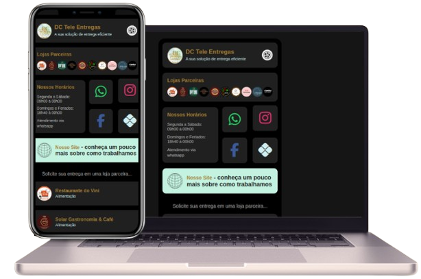

# Imagem do Projeto


# Link Biografia - DC Tele Entregas

Este site, originalmente criado por <a href="https://github.com/RicardoMouraa">Ricardo Moura</a> como um hub de links, passou por uma adaptação para atender às necessidades de uma empresa de tele-entregas. As modificações incluíram uma reformulação visual completa, com a adição de elementos gráficos e interativos mais adequados ao novo propósito. Além disso, foi implementada uma funcionalidade que permite aos usuários acessarem diretamente o WhatsApp das lojas parceiras, facilitando a realização de pedidos. 

## Características

- **Loading Screen Customizado:** Uma tela de carregamento animada que mostra o progresso em porcentagem até que o site esteja completamente carregado.
- **Perfil da Empresa:** Informações da empresa com logo, nome e descrição.
- **Lojas Parceiras:** Ícones das logotipos de cada loja parceira destacando a confiabilidade nas entregas.
- **Links para Redes Sociais:** Links diretos para WhatsApp, Instagram Facebook.
- **Botão para cópia da Chave Pix:** Botão que realiza a copia para área de tranferência da chave pix da empresa.
- **Widget de Horário de Atendimento:** Área reserva para as informações dos horários de atendimentos.
- **Site da Empresa:** Link para o site da empresa.

## Tecnologias Utilizadas

- HTML5
- CSS3
- JavaScript
- FontAwesome para ícones
- Roboto Font do Google Fonts

## Estrutura de Arquivos

```plaintext
/projeto
|-- index.html
|-- style.css
|-- script.js
|-- /images
    |-- dc-tele-entregas-link-bio.png
    |-- logo-dc.png
    |-- web-black-icon.png
    |-- web-white-icon.png
    |-- wheel-icon.svg
    |-- /lojas
        |-- cacau.png
        |-- casachina.png
        |-- (...)
        |-- vini.png
```

## Como Usar

1. Clone o repositório em sua máquina local usando `git clone [URL do Repositório]`.
2. Abra o arquivo `index.html` em um navegador para visualizar o site.
3. Explore as diferentes seções clicando nos links e ícones disponíveis.

## Contribuições

Contribuições são sempre bem-vindas! Se você tem alguma sugestão para melhorar este projeto, sinta-se à vontade para fazer um fork do repositório e enviar sua pull request.

## Autor do Site Original

**Ricardo Moura**
- [Perfil no GitHub](https://github.com/RicardoMouraa)
- [LinkedIn](https://www.linkedin.com/in/ricardomouradev/)
- [Instagram](https://www.instagram.com/riicardomoura/)

## Autor do Fork

**Dionatan Rodrigues**
- [Perfil no GitHub](https://github.com/Dionatan2019Rodrigues)
- [LinkedIn](https://www.linkedin.com/in/dionatan-eduardo-correa-rodrigues-76b507255/)

